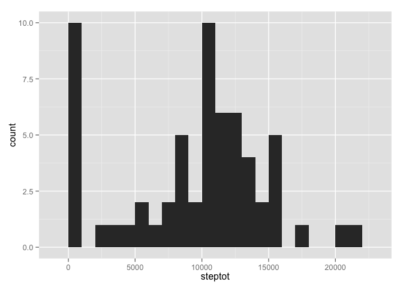
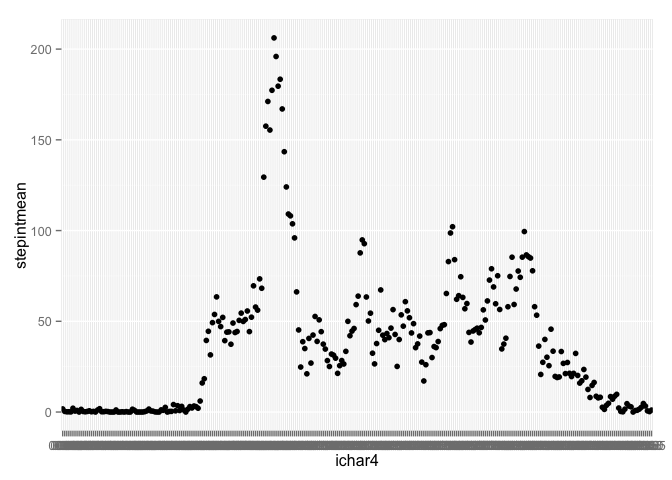
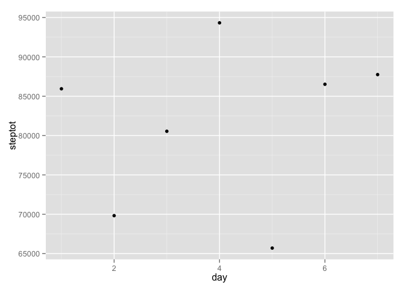

# Reproducible Research: Peer Assessment 1


```r
## Open relevant libraries
library(lubridate)
library(stringr)
library(ggplot2)
library(dplyr)
```

```
## 
## Attaching package: 'dplyr'
## 
## The following objects are masked from 'package:lubridate':
## 
##     intersect, setdiff, union
## 
## The following object is masked from 'package:stats':
## 
##     filter
## 
## The following objects are masked from 'package:base':
## 
##     intersect, setdiff, setequal, union
```

## Loading and preprocessing the data
The first step is to load the csv file

```r
activity <- tbl_df(read.csv(file = "activity.csv",stringsAsFactors = FALSE))
activity2 <- activity %>%
  mutate(ichar4 = str_pad(as.character(interval), 4, pad = "0")) %>%
  mutate(ihour = str_sub(ichar4, 1, 2)) %>%
  mutate(imin = str_sub(ichar4, 3, 4)) %>%
  mutate(dt = ymd_hm(paste(date, " ", ihour, ":", imin, sep = ""))) %>%
  select(steps, ichar4, dt)
```


## What is mean total number of steps taken per day?

```r
steptot <- activity2 %>%
  mutate(day = yday(dt)) %>%
  group_by(day) %>%
  summarize (steptot = sum(steps, na.rm = TRUE))
mean(steptot$steptot)
```

```
## [1] 9354.23
```

```r
median(steptot$steptot)
```

```
## [1] 10395
```

```r
qplot(steptot, data=steptot, geom="histogram", binwidth = 1000)
```

 

## What is the average daily activity pattern?

```r
stepint <- activity2 %>%
  group_by(ichar4) %>%
  summarize (stepintmean = mean(steps, na.rm = TRUE))

qplot(ichar4, stepintmean, data = stepint)
```

 

```r
max(stepint$stepintmean)
```

```
## [1] 206.1698
```

```r
stepint
```

```
## Source: local data frame [288 x 2]
## 
##    ichar4 stepintmean
## 1    0000   1.7169811
## 2    0005   0.3396226
## 3    0010   0.1320755
## 4    0015   0.1509434
## 5    0020   0.0754717
## 6    0025   2.0943396
## 7    0030   0.5283019
## 8    0035   0.8679245
## 9    0040   0.0000000
## 10   0045   1.4716981
## ..    ...         ...
```

## Imputing missing values

```r
activity3 <- activity2 %>%
  group_by(ichar4) %>%
  mutate(intmean = mean(steps, na.rm = TRUE)) %>%
  mutate(stepsnew = ifelse(is.na(steps), intmean, steps))

steptot2 <- activity3 %>%
  mutate(day = yday(dt)) %>%
  group_by(day) %>%
  summarize (steptot = sum(stepsnew, na.rm = TRUE))
mean(steptot2$steptot)
```

```
## [1] 10766.19
```

```r
median(steptot2$steptot)
```

```
## [1] 10766.19
```

```r
qplot(steptot, data=steptot2, geom="histogram", binwidth = 1000)
```

 

```r
stepint2 <- activity3 %>%
  group_by(ichar4) %>%
  summarize (stepintmean = mean(stepsnew, na.rm = TRUE))

qplot(ichar4, stepintmean, data = stepint2)
```

 

```r
max(stepint$stepintmean)
```

```
## [1] 206.1698
```

```r
stepint2
```

```
## Source: local data frame [288 x 2]
## 
##    ichar4 stepintmean
## 1    0000   1.7169811
## 2    0005   0.3396226
## 3    0010   0.1320755
## 4    0015   0.1509434
## 5    0020   0.0754717
## 6    0025   2.0943396
## 7    0030   0.5283019
## 8    0035   0.8679245
## 9    0040   0.0000000
## 10   0045   1.4716981
## ..    ...         ...
```

## Are there differences in activity patterns between weekdays and weekends?

```r
steptotwday <- activity3 %>%
  mutate(day = wday(dt)) %>%
  group_by(day) %>%
  summarize (steptot = sum(steps, na.rm = TRUE))
  
qplot(day, steptot, data = steptotwday)
```

 

```r
activity4 <- activity3 %>%
  mutate(daytype = ifelse(wday(dt) == 6 | wday(dt) == 7, "weekend", "weekday")) %>%
  group_by(daytype) %>%
  summarize(mean(steps, na.rm = TRUE))

stepint3 <- activity3 %>%
  mutate(daytype = ifelse(wday(dt) == 6 | wday(dt) == 7, "weekend", "weekday")) %>%
  group_by(daytype,ichar4) %>%
  summarize (stepintmean = mean(steps, na.rm = TRUE))

qplot(ichar4, stepintmean, data = stepint3, facets = .~daytype)
```

 


