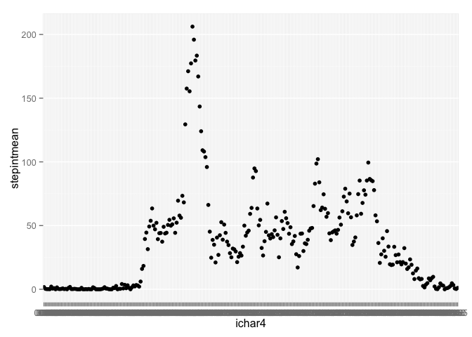
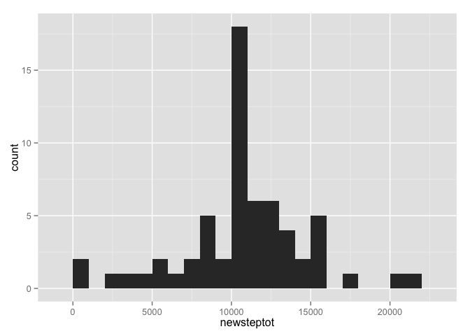
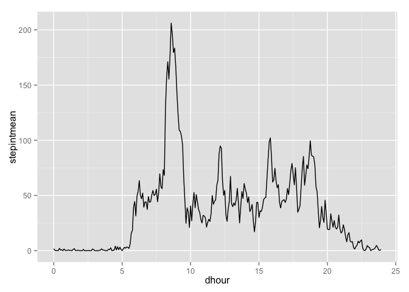

# Reproducible Research: Peer Assessment 1
This is an exploratory data analysis of 2 days worth of step data collected on a single individual at 5 minute intervals.

I use several libraries.


```r
## Open relevant libraries
library(lubridate)
library(stringr)
library(ggplot2)
library(dplyr)
```

```
## 
## Attaching package: 'dplyr'
## 
## The following objects are masked from 'package:lubridate':
## 
##     intersect, setdiff, union
## 
## The following object is masked from 'package:stats':
## 
##     filter
## 
## The following objects are masked from 'package:base':
## 
##     intersect, setdiff, setequal, union
```

## Loading and preprocessing the data
The first step is to load the csv file, which is called activity.csv and is located in the current directory.

I convert it to tbl_df for better printing.

The raw file looks as follows.  Note that there are many NAs in the steps column.  The time interval reads as an integer.


```r
activity <- tbl_df(read.csv(file = "activity.csv",stringsAsFactors = FALSE))
activity
```

```
## Source: local data frame [17,568 x 3]
## 
##    steps       date interval
## 1     NA 2012-10-01        0
## 2     NA 2012-10-01        5
## 3     NA 2012-10-01       10
## 4     NA 2012-10-01       15
## 5     NA 2012-10-01       20
## 6     NA 2012-10-01       25
## 7     NA 2012-10-01       30
## 8     NA 2012-10-01       35
## 9     NA 2012-10-01       40
## 10    NA 2012-10-01       45
## ..   ...        ...      ...
```

I preprocess the data by creating a new column called ichar4 which is a string version of the time interval padded with zeros.  I then paste this string to the date string to create a POSIXct date-time called dt.  This makes use of the dplyr library and the lubridate library.


```r
activity2 <- activity %>%
  mutate(ichar4 = str_pad(as.character(interval), 4, pad = "0")) %>%
  mutate(ihour = str_sub(ichar4, 1, 2)) %>%
  mutate(imin = str_sub(ichar4, 3, 4)) %>%
  mutate(dt = ymd_hm(paste(date, " ", ihour, ":", imin, sep = ""))) %>%
  select(steps, dt, ichar4)
activity2
```

```
## Source: local data frame [17,568 x 3]
## 
##    steps                  dt ichar4
## 1     NA 2012-10-01 00:00:00   0000
## 2     NA 2012-10-01 00:05:00   0005
## 3     NA 2012-10-01 00:10:00   0010
## 4     NA 2012-10-01 00:15:00   0015
## 5     NA 2012-10-01 00:20:00   0020
## 6     NA 2012-10-01 00:25:00   0025
## 7     NA 2012-10-01 00:30:00   0030
## 8     NA 2012-10-01 00:35:00   0035
## 9     NA 2012-10-01 00:40:00   0040
## 10    NA 2012-10-01 00:45:00   0045
## ..   ...                 ...    ...
```


## What is mean total number of steps taken per day?
To calculate the average steps per day I extract the day of the year from the POSIXct date using the lubridate function yday and then group by day.  This groups all the intervals for a given day together.  I then run a summarize using the sum function to get the total steps per day for each day.  This daily totals summary is stored in a new dataframe called steptot which is shown below.

Finally I take the mean and the median of the total steps per day from the new dataframe, and I run a ggplot2 quickplot histogram to show the distribution of total steps per day.


```r
steptot <- activity2 %>%
  mutate(day = yday(dt)) %>%
  group_by(day) %>%
  summarize (steptot = sum(steps, na.rm = TRUE))
steptot
```

```
## Source: local data frame [61 x 2]
## 
##    day steptot
## 1  275       0
## 2  276     126
## 3  277   11352
## 4  278   12116
## 5  279   13294
## 6  280   15420
## 7  281   11015
## 8  282       0
## 9  283   12811
## 10 284    9900
## .. ...     ...
```

```r
mean(steptot$steptot)
```

```
## [1] 9354.23
```

```r
median(steptot$steptot)
```

```
## [1] 10395
```

```r
qplot(steptot, data=steptot, geom="histogram", binwidth = 1000)
```

 

## What is the average daily activity pattern?
For the average daily pattern I want to show the average number of steps for each time interval during the day.  This is averaged across all days - ie it is showing a typical pattern for a day.

To do this I run a new summarization, but this time grouping by time interval (and ignoring the day).  For convenience I use the ichar4 string for this which I created as part of getting the POSIXct date at the beginning.  I take the mean of the number of steps for each time interval and store it in a new dataframe called stepint which is shown below.

I then create a time series graph (which actually uses strings on the x axis in sorted order) to show the pattern over the course of a typical day.

Finally I determine the time interval with the maximum average number of steps, which occurs at 0835 in the morning.


```r
stepint <- activity2 %>%
  group_by(ichar4) %>%
  summarize (stepintmean = mean(steps, na.rm = TRUE))
stepint
```

```
## Source: local data frame [288 x 2]
## 
##    ichar4 stepintmean
## 1    0000   1.7169811
## 2    0005   0.3396226
## 3    0010   0.1320755
## 4    0015   0.1509434
## 5    0020   0.0754717
## 6    0025   2.0943396
## 7    0030   0.5283019
## 8    0035   0.8679245
## 9    0040   0.0000000
## 10   0045   1.4716981
## ..    ...         ...
```

```r
qplot(ichar4, stepintmean, data = stepint)
```

 

```r
stepint[stepint$stepintmean == max(stepint$stepintmean),]
```

```
## Source: local data frame [1 x 2]
## 
##   ichar4 stepintmean
## 1   0835    206.1698
```

## Imputing missing values
There are 2304 time intervals with missing step values in the original data set.  This is calculated by checking for is.na and then taking a sum, which adds up all the TRUES, as shown below.


```r
sum(is.na(activity2$steps))
```

```
## [1] 2304
```

To impute values for these missing values, I used the previous day pattern analysis, and determined the average step count for each interval (grouping by interval summarizing by mean).  I then created a new column called intmean to store this average with each observation.  I then created another new column called stepsnew which contains the actual step count if it is known, or the average step count for the interval if it was NA in the original data.


```r
activity3 <- activity2 %>%
  group_by(ichar4) %>%
  mutate(intmean = mean(steps, na.rm = TRUE)) %>%
  mutate(stepsnew = ifelse(is.na(steps), intmean, steps))
activity3[285:295,] # selecting a point that shows both NA and values for steps
```

```
## Source: local data frame [11 x 5]
## Groups: ichar4
## 
##    steps                  dt ichar4   intmean  stepsnew
## 1     NA 2012-10-01 23:40:00   2340 3.3018868 3.3018868
## 2     NA 2012-10-01 23:45:00   2345 0.6415094 0.6415094
## 3     NA 2012-10-01 23:50:00   2350 0.2264151 0.2264151
## 4     NA 2012-10-01 23:55:00   2355 1.0754717 1.0754717
## 5      0 2012-10-02 00:00:00   0000 1.7169811 0.0000000
## 6      0 2012-10-02 00:05:00   0005 0.3396226 0.0000000
## 7      0 2012-10-02 00:10:00   0010 0.1320755 0.0000000
## 8      0 2012-10-02 00:15:00   0015 0.1509434 0.0000000
## 9      0 2012-10-02 00:20:00   0020 0.0754717 0.0000000
## 10     0 2012-10-02 00:25:00   0025 2.0943396 0.0000000
## 11     0 2012-10-02 00:30:00   0030 0.5283019 0.0000000
```

I then run the same analysis for mean and median daily step totals and the histogram of step totals using stepsnew instead of the actual steps to see how they compare.


```r
steptot2 <- activity3 %>%
  mutate(day = yday(dt)) %>%
  group_by(day) %>%
  summarize (newsteptot = sum(stepsnew, na.rm = TRUE))
steptot2
```

```
## Source: local data frame [61 x 2]
## 
##    day newsteptot
## 1  275   10766.19
## 2  276     126.00
## 3  277   11352.00
## 4  278   12116.00
## 5  279   13294.00
## 6  280   15420.00
## 7  281   11015.00
## 8  282   10766.19
## 9  283   12811.00
## 10 284    9900.00
## .. ...        ...
```
Notice that the first day of the series, which previously had 0 steps, now has 10,766, which also happens to be the mean for all days.

Also note that the mean and median are now exactly the same, which may require further investigation.


```r
mean(steptot2$newsteptot)
```

```
## [1] 10766.19
```

```r
median(steptot2$newsteptot)
```

```
## [1] 10766.19
```

```r
qplot(newsteptot, data=steptot2, geom="histogram", binwidth = 1000)
```

 

Finally we look again at the daily activity pattern but including imputed values.  It looks very similar.

It seems that using imputed values has very little effect on the calculated averages.  It does effect the histogram though since there are fewer ZERO days.


```r
stepint2 <- activity3 %>%
  group_by(ichar4) %>%
  summarize (stepintmean = mean(stepsnew, na.rm = TRUE))
stepint2
```

```
## Source: local data frame [288 x 2]
## 
##    ichar4 stepintmean
## 1    0000   1.7169811
## 2    0005   0.3396226
## 3    0010   0.1320755
## 4    0015   0.1509434
## 5    0020   0.0754717
## 6    0025   2.0943396
## 7    0030   0.5283019
## 8    0035   0.8679245
## 9    0040   0.0000000
## 10   0045   1.4716981
## ..    ...         ...
```

```r
qplot(ichar4, stepintmean, data = stepint2)
```

 

```r
stepint2[stepint2$stepintmean == max(stepint2$stepintmean),]
```

```
## Source: local data frame [1 x 2]
## 
##   ichar4 stepintmean
## 1   0835    206.1698
```

## Are there differences in activity patterns between weekdays and weekends?

For this last section I use the data which includes imputed values.

I create a new dataset which contains a new column called daytype.  This is a factor variable that has two possible labels - weekday or weekend.


```r
activity4 <- activity3 %>%
  #mutate(daytype = ifelse(wday(dt) == 6 | wday(dt) == 7, "weekend", "weekday")) %>%
  mutate(daytype = factor(1 * (wday(dt) == 6 | wday(dt) == 7),labels = c("weekday","weekend")))
```

Finally we look at a panel plot showing side by side the breakdown of activity levels by time interval on the weekdays compared to the weekends.


```r
stepint3 <- activity3 %>%
  mutate(daytype = ifelse(wday(dt) == 6 | wday(dt) == 7, "weekend", "weekday")) %>%
  group_by(daytype,ichar4) %>%
  summarize (stepintmean = mean(steps, na.rm = TRUE))

qplot(ichar4, stepintmean, data = stepint3, facets = daytype~.)
```

 


